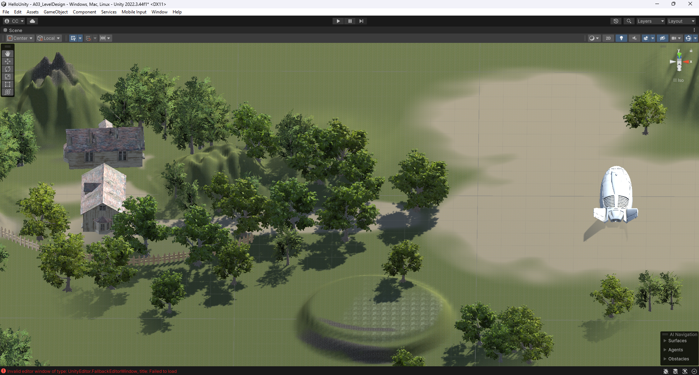
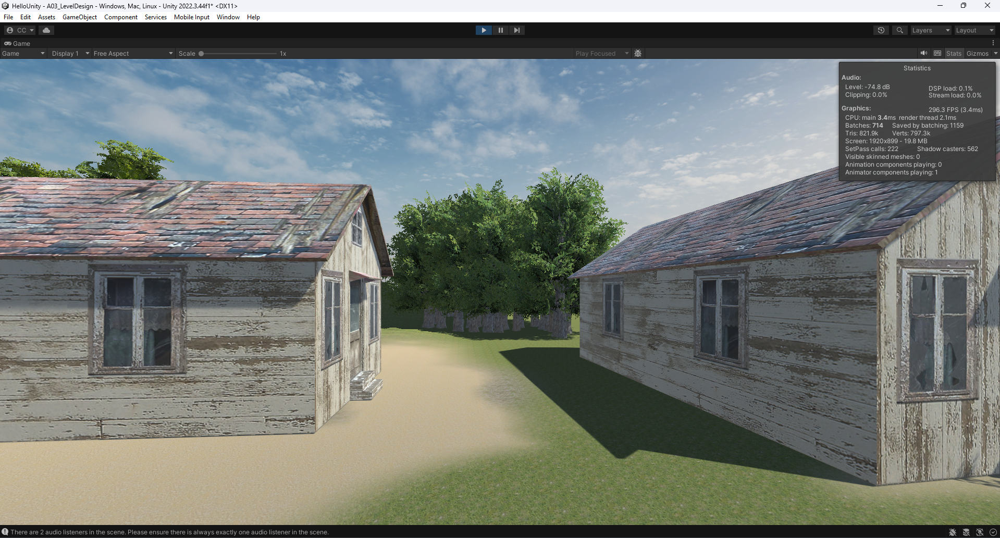
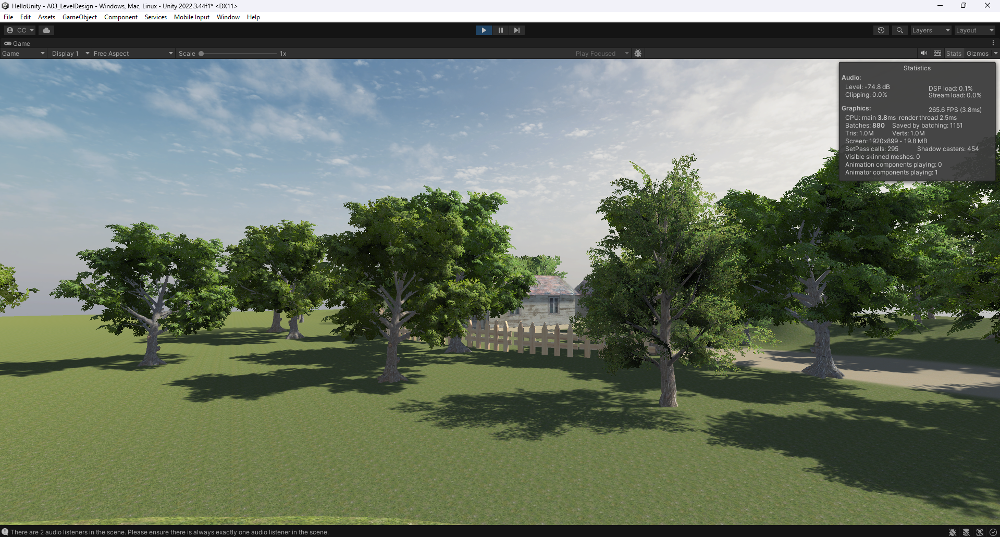
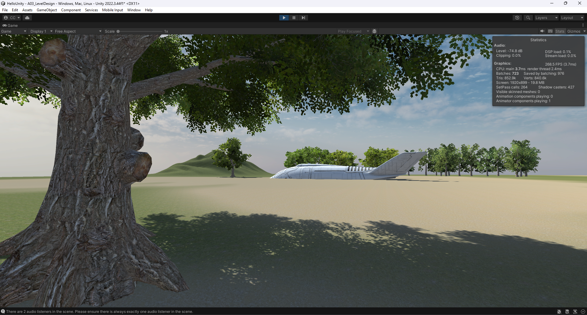

# RPG Game
## Camera
```
Rigid Follow Camera
```

```
Spring Follow Camera
```


## Level Buildup
```
Left Side: a small village where the player will start
Right Side: a quest area where a plane crash happened
```






## Flythrough camera & POI


## Credits
```
https://free3d.com/3d-model/abandoned-cottage-house-825251.html
https://free3d.com/3d-model/3d-well-137846.html
https://free3d.com/3d-model/simple-fence-68101.html
https://assetstore.unity.com/packages/3d/characters/humanoids/humans/lowpoly-bountyhunter-rio-2-287264

Tutorial:
https://learn.unity.com/tutorial/shi-yong-terrain-editor#5f603b56edbc2a002021e296
```

