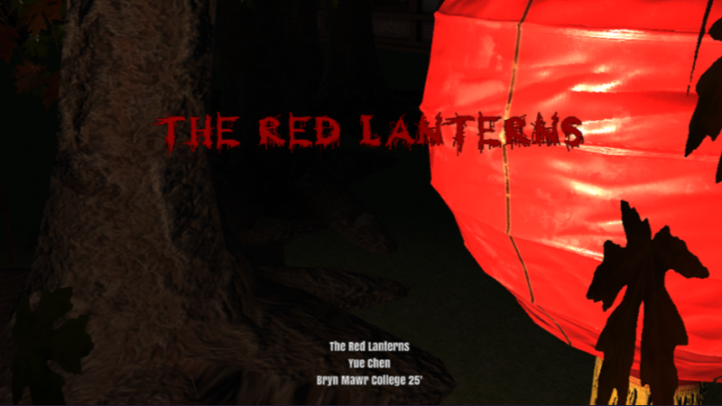
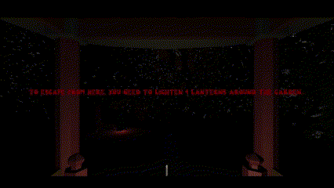
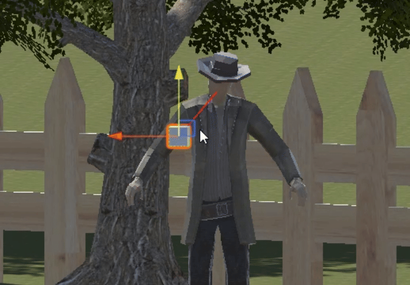

# The Red Lanterns
A 3D horror game made by unity  

## How to Play
```
Use "WASD" to control the movement
Use Mouse to control the view/angle
Use "F" to use the candle
Use "E" to light the lantern

By lighting the four lanterns located around the garden, the player wins the game.
```
## How to Build and Run in Unity
```
Open "HelloUnity"
Choose "Scenes/The_Red_Lantern.unity" to build and run
```
## Demo Video



  
[](https://youtu.be/uY2yV0wbGas)

## Important Features
1. **Increasing Volume and Picth of BGM**
   When the ghost is getting close to the player, the volume and the pitch of the BGM will increase. Script: "FinalProject/AudioController.cs"

2. **Red Screen Effect**
   When the ghost is getting close to the player, the screen turns to red gradually. Script: "FinalProject/AudioController.cs"

3. **Increasing Detect Distance**
    When the candle is being used, the distance for the ghost to detect the player inceases by 10. Script: "FinalProject/GhostBehavior.cs"

4. **Safe Pavilion Area**
    When the player is chased by the ghost, the player can return to the pavilion to make the ghost lose the target. Script: "FinalProject/GhostBehavior.cs"

5. **Jump Scare**
    When the ghost reaches the player, it pop up at the player's screen. Script: "FinalProject/GhostBehavior.cs"

6. **Random Locations of Trees and Lanterns**
    Using the script to spawn trees and allocate the locations of four lanterns to avoid memorizing. Script: "FinalProject/TreeSpawner.cs"

7. **First Person Camera**
    Placing the camera around the chest of the character. Moving with the character controller. Script: "FinalProject/FirstPersonCamera.cs"

8. **Candle Collection and Usage**
    The player collide with the candle to collect it. Once the candle is collected, it appears at the character's left hand and can by used by pressing "F". Script: "FinalProject/CandleCollect.cs"
   
# RPG Game
## NPC Behaviors
### Week 11
#### Enemy NPC
```
attack the player if the player comes within range of it
retreat if the the player returns to their home area
follow the player if the player runs away
```


#### Companion  NPC
```
follow the player if the player comes to him
follow the enemy if the enemy comes within range of it
```


## AI: Wander
### Week 10


## Feature: Collection Game
### Week 9
```
Implementing the object spawner and pick-up animation
```

## Feature: Motion and Collider
### Week 8


## FollowPath
```
Linear
```


```
Cubic
```


## inverse kinematics
```
Gaze Controller
```

```
Two Chain Controller
```


## Camera
```
Rigid Follow Camera
```

```
Spring Follow Camera
```


## Flythrough camera & POI


## Level Buildup
```
Left Side: a small village where the player will start
Right Side: a quest area where a plane crash happened
```


## Credits
```
https://free3d.com/3d-model/abandoned-cottage-house-825251.html
https://free3d.com/3d-model/3d-well-137846.html
https://free3d.com/3d-model/simple-fence-68101.html
https://assetstore.unity.com/packages/3d/characters/creatures/alien-insect-character-16469
https://assetstore.unity.com/packages/3d/characters/humanoids/humans/lowpoly-bountyhunter-rio-2-287264

Tutorial:
https://learn.unity.com/tutorial/shi-yong-terrain-editor#5f603b56edbc2a002021e296
```

